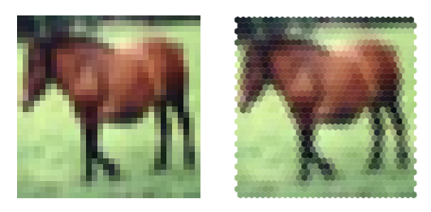

========================================================================================
Indexed operations for non-rectangular lattices applied to convolutional neural networks
========================================================================================

This section presents the content of the paper 

Jacquemont, M.; Antiga, L.; Vuillaume, T.; Silvestri, G.; Benoit, A.; Lambert, P. and Maurin, G. (2019). **Indexed Operations for Non-rectangular Lattices Applied to Convolutional Neural Networks**. In Proceedings of the 14th International Joint Conference on Computer Vision, Imaging and Computer Graphics Theory and Applications - Volume 5: VISAPP, ISBN 978-989-758-354-4, pages 362-371. DOI: 10.5220/0007364303620371,
https://hal.science/hal-02087157/

.. _`sec:authors`:

**Authors**

Mikael Jacquemont\ :sup:`1,2`, Luca Antiga\ :sup:`3`, Thomas Vuillaume\ :sup:`1`, Giorgia Silvestri\ :sup:`3`, Alexandre Benoit\ :sup:`2`, Patrick Lambert\ :sup:`2` and Gilles Maurin\ :sup:`1`

- :sup:`1` Laboratoire d'Annecy de Physique des Particules, CNRS, Univ. Savoie Mont-Blanc, Annecy, France, firstname.name@lapp.in2p3.fr
- :sup:`2` LISTIC, Univ. Savoie Mont-Blanc, Annecy, France, firstname.name@univ-smb.fr
- :sup:`3` Orobix, Bergamo, Italy, firstname.name@orobix.com

.. _`sec:introduction`:

INTRODUCTION
============

Traditional convolutional kernels have been developed for rectangular
and regular pixel grids as found in traditional images. However, some
imaging sensors present different shapes and do not have regularly
spaced nor rectangular pixel lattices. This is particularly the case in
science experiments where sensors use various technologies and must
answer specific technological needs. Examples (displayed in :ref:`figure 1<sensors>`)
of such sensors in physics include the XENON1T experiment
:cite:`2013SPPhy14887S`, the KM3NeT experiment
:cite:`Katz:2012zz` or Imaging Atmospheric Cherenkov
Telescope (IACT) cameras such as the ones of H.E.S.S.
:cite:`BOLMONT201446` or the Cherenkov Telescope Array
(CTA) (NectarCam, :cite:`2013arXiv1307.4545G`; LSTCam,
:cite:`ambrosi2013cherenkov`; and FlashCam,
:cite:`2012AIPC.1505..777P`).

.. _sensors:

|image| |image1|

A traditional approach to overcome this and use traditional convolution
neural network framework out of the box is to over-sample the image into
a Cartesian grid. For regular lattices, such as hexagonal ones, it is
also possible to apply geometrical transformation to the images to shift
them into Cartesian grids. In that case, masked convolutions can be used
to respect the original layout of the images, like in HexaConv
:cite:`hoogeboom2018hexaconv`. In this paper, the authors
present group convolutions for square pixels and hexagonal pixel images.
A group convolution consists in applying several transformations (e.g.
rotation) to the convolution kernel to benefit from the axis of symmetry
of the images. In the hexagonal grid case they use masked convolutions
applied to hexagonal pixel images represented in the Cartesian grid (via
shifting).

However, such approaches may have several drawbacks:

-  oversampling or geometric transformation may introduce distortions
   that can potentially result in lower accuracy or unexpected results;

-  oversampling or geometric transformation impose additional
   processing, often performed at the CPU level which slows inference in
   production;

-  geometric transformation with masked convolution adds unnecessary
   computations as the mask has to be applied to the convolution kernel
   at each iteration;

-  oversampling or geometric transformations can change the image shape
   and size.

In order to prevent these issues and be able to work on unaltered data,
we present here a way to apply convolution and pooling operators to any
grid, given that each pixel neighbor is known and provided. This
solution, denoted indexed operations in the following, driven by
scientific applications, is applied to an hexagonal kernel since this is
one of the most common lattice besides the Cartesian one. However,
indexed convolution and pooling are very general solutions, easily
applicable to other domains with irregular grids.

At first, a reminder of how convolution and pooling work and are usually
implemented is done. Then we present our custom indexed kernels for
convolution and pooling. This solution is then applied to standard
datasets, namely CIFAR-10 and AID to validate the approach and test
performances. Finally, we discuss the results obtained as well as
potential applications to real scientific use cases.

.. _`sec:convolution`:

CONVOLUTION
===========

Background
----------

Convolution is a linear operation performed on data over which
neighborhood relationships between elements can be defined. The output
of a convolution operation is computed as a weighted sum (i.e. a dot
product) over input neighborhoods, where the weights are reused over the
whole input. The set of weights is referred to as the convolution
*kernel*. Any input data can be vectorized and then a general definition
of convolution can be defined as:

.. math:: O_{j} = \sum_{k=1}^{K}{w_k I_{N_{jk}}}

where :math:`K` is the number of elements in the kernel, :math:`w_k` is
the value of the :math:`k`-th weight in the kernel, and :math:`N_{jk}`
is the index of the :math:`k`-th neighbor of the :math:`j`-th
neighborhood.

This general formulation of discrete convolution can be then made more
specific for data over which neighborhood relationships are inherent in
the structure of the input, such as 1D (temporal), 2D (image) and 3D
(volumetric) data. For instance, in the case of classical images with
square pixels, we define convolution as:

.. math::

   O_{ij} = \sum_{k=-W}^{W} \sum_{h=-H}^{H} {w_{kh} I_{(i-k)(j-h)}}

where the convolution kernel is a square matrix of size
:math:`(2W+1, 2H+1)` and neighborhoods are implicitly defined through
corresponding relative locations from the center pixel. Analogous
expressions can be defined in N dimensions.

Since the kernel is constant over the input, i.e. its values do not
depend on the location over the input, convolution is a linear
operation. In addition, it has the advantage of accounting for locality
and translation invariance, i.e. output values solely depend on input
values in local neighborhoods, irrespective of where in the input those
values occur.

Convolution cannot be performed when part of the neighborhood cannot be
defined, such as at the border of an image. In this case, either the
corresponding value in the output is skipped, or neighborhoods are
extended beyond the reach of the input, which is referred to as
*padding*. Input values in the padded region can be set to zero, or
reproduce the same values as the closest neighbors in the input.

It is worth noting that the convolution can be computed over a subset of
the input elements. On regular lattices this results in choosing one
every :math:`n` elements in each direction, an amount generally referred
as *stride*. The larger the stride, the smaller the size of the output.

The location of neighbors in convolution kernels does not need to be
adjacent, as it is in the image formulation above. Following the first
expression, neighborhoods can be defined arbitrarily, in terms of shape
and location of the neighbors. In case of regular lattices the amount of
separation between the elements of a convolution kernel in each
direction is referred to as *dilation* or *atrous* convolution
:cite:`atrousconv`. The larger the dilation, the further
away from the center the kernel reaches out in the neighborhood.

In case of inputs with multiple channels such as an RGB images, or
multiple features in intermediate layers in a neural network, all input
channels contribute to the output and convolution is simply obtained as
the sum of dot products over all the individual channels to produce
output values. Equation :eq:`conv_channels` shows
the 2D image convolution case with :math:`C` input channels.

.. math::
   :label: conv_channels

   O_{ij} = \sum_{c=1}^{C} \sum_{k=-W}^{W} \sum_{h=-H}^{H} {w_{ckh} I_{c(i-k)(j-h)}}

Therefore, the size of kernels along the channel direction determines
the number of input features that the convolution operation expects,
while the number of individual kernels employed in a neural network
layer determines the number of features in the output.

Implementation
--------------

In neural network applications convolutions are performed over small
spatial neighborhoods (e.g. :math:`3 \times 3`, :math:`5 \times 5` for
2D images). Given the small size of the elements in the dot product, the
most computationally efficient strategy for computing the convolution is
not an explicitly nested loop as described on equation
:eq:`conv_channels`, but a vectorized dot product over all
neighborhoods. Then, as most deep learning frameworks intensively do,
one can make use of the highly optimized matrix multiplication operators
available in linear algebra libraries
:cite:`vandeGeijn2011`. Let us consider the *im2col*
operation that transforms any input (1D, 2D, 3D and so on) into a 2D
matrix where each column reports the values of the neighbors to consider
for each of the input samples (respectively, time stamp, pixel, voxel
and so on) as illustrated in the example given in
:ref:`figure 2 <fig_im2col>`. Given this layout, convolution consists in applying
the dot product of each column with the corresponding flattened,
columnar arrangement of weights of the convolution kernel. Performing
the dot product operation over all neighborhoods amounts to a matrix
multiplication between the column weights and the column image.

.. _fig_im2col:

   Example of pixel neigborghood arrangements for a :math:`3 \times 3`
   kernel.

In multiple channel case (see equation
:eq:`conv_channels` for :math:`C` input
channels), all input channels contribute to the output. At the column
matrix level, this translates into stacking individual columns from all
channels along a single column, and similarly for the kernel weights.
Conversely, in order to account for multi-channel output, multiple
column matrices are considered, or, equivalently, the column matrix and
the corresponding kernel weights have an extra dimension along
:math:`C_{out}`.

In this setting, striding consists in applying the *im2col* operation on
a subset of the input, while dilation consists in building columns
according to the dilation factor, using non-immediate neighbors. Last,
padding can be achieved by adding zeros (or the padded values of choice)
along the columns of the column matrix.

Owing to the opportunity for vectorization and cache friendliness of the
general matrix multiply operations (GEMM), the resulting gains in
efficiency outweigh the additional memory consumption due to duplication
of values in the column image, since every value in the input image will
be replicated in as many locations as the neighbors it participates to
(see :ref:`figure 2 <fig_im2col>`).

The :math:`im2col` operation is easily reversible. This will be
considered for deep neural networks training steps where the backward
gradient propagation is applied in order to optimize the network
parameters.

.. _`sec:indexed_kernels`:

INDEXED KERNELS
===============

Given the general interpretation of convolution and its implementation
as given in the previous sections, the extension of convolution from
rectangular lattices to more general arrangements is now
straightforward.

Given an input vector of data and a matrix of indices describing every
neighborhood relationships among the elements of the input vectors, a
column matrix is constructed by picking elements from the input vector
according to each neighborhood in the matrix of indices. Analogously to
the case of rectangular lattices, neighborhoods from different input
channels are concatenated along individual columns, as are kernel
weights. At this point, convolution can be computed as a matrix
multiplication.

We will now show how the above procedure can be performed in a
vectorized fashion by resorting to advanced indexing. Modern
multidimensional array frameworks, such as NumPy, TensorFlow and
PyTorch, implement advanced indexing, which consists in indexing
multidimensional arrays with other multidimensional arrays of integer
values. The integer arrays provide the shape of the output and the
indices at which the output values must be picked out of the input
array.

In our case, we can use the matrix of indices describing neighborhoods
in order to index into the input tensor, producing the column matrix in
one pass, both on CPU and GPU devices. Since the indexing operation is
differentiable with respect to the input (but not with respect to the
indices), a deep learning framework equipped with automatic
differentiation capabilities (like PyTorch or TensorFlow) can provide
the backward pass automatically as needed.

We will now present a PyTorch implementation of such *indexed
convolution* in a hypothetical case.

We consider in the following example an input tensor with shape
:math:`B, C_{in}, W_{in}`, where :math:`B` is the batch size equal to 1,
:math:`C_{in}` is the number of channels equal to 2, or features, and
:math:`W_{in}` is the width equal to 5, i.e. the number of elements per
channel,

.. container:: small

   ::

      input = torch.ones(1, 2, 5)

and a specification of neighbors as an indices tensor with shape
:math:`K, W_{out}`, where :math:`K` is the size of the convolution
kernel equal to 3 and :math:`W_{out}` equal to 4 is the number of
elements per channel in the output

.. container:: small

   ::

      indices = torch.tensor([[ 0, 0, 3, 4],
                              [ 1, 2, 4, 0],
                              [ 2, 3, 0, 1]])

where values, arbitrarily chosen in this example, represent the indices
of 4 neighborhoods of size 3 (i.e. neighborhoods are laid out along
columns). The number of columns corresponds to the number of
neighborhoods, i.e. dot products, that will be computed during the
matrix multiply, hence they correspond to the size of the output per
channel.

The weight tensor describing the convolution kernels has shape
:math:`[C_{out}, C_{in}, K]`, where :math:`C_{out}` equal to 3 is the
number of channels, or features, in the output. The bias is a column
vector of size :math:`C_{out}`.

.. container:: small

   ::

      weight = torch.ones(3, 2, 3)
      bias = torch.zeros(3)

At this point we can proceed to use advanced indexing to build the
column matrix according to indices.

.. container:: small

   ::

      col = input[..., indices]

Here we are indexing a :math:`B, C_{in}, W_{in}` tensor with a
:math:`K, W_{out}` tensor, but the indexing operation has to preserve
batch and input channels dimensions. To this end, we employ the ellipsis
notation :math:`...`, which prescribes indexing to be replicated over
all dimensions except the last. This operation produces a tensor shaped
:math:`B, C_{in}, K, W_{out}`, i.e. :math:`1, 2, 3, 4`.

As noted above, the column matrix needs values from neighborhoods for
all input channels concatenated along individual columns. This is
achieved by reshaping the *col* tensor so that :math:`C_{in}` and
:math:`K` dimensions are concatenated:

::

   B = input.shape[0]
   W_out = indices.shape[1]

   col = col.view(B, -1, W_out)

The columns in the *col* tensor are now a concatenation of 3 values (the
size of the kernel) per input channel, resulting in a
:math:`B, K \cdot C_{in}, W_{out}`. Note that the *col* tensor is still
organized in batches.

At this point, weights must be arranged so that weights from different
channels are concatenated along columns as well:

::

   C_out = weight.shape[0]
   weight_col = weight.view(C_out, -1)

which leads from a :math:`C_{out}, C_{in}, K` to a
:math:`C_{out}, K \cdot C_{in}` tensor.

Multiplying the *weight_col* and *col* matrices will now perform the
vectorized dot product corresponding to the convolution:

::

   out = torch.matmul(weight_col, col)

Note that we are multiplying a :math:`C_{out}, K \cdot C_{in}` tensor by
a :math:`B, K \cdot C_{in}, W_{out}` tensor, to obtain a
:math:`B, C_{out}, W_{out}` tensor. In this case, the :math:`B`
dimension has been automatically broadcast, without extra allocations.

In case *bias* is used in the convolution, it must be added to each
element of the output, i.e. a constant is summed to all values per
output channel. In this case, *bias* is a tensor of shape
:math:`C_{out}`, so we can perform the operation by again relying on
broadcasting on the first :math:`B` and last :math:`W_{out}` dimension:

::

   out += bias.unsqueeze(1)

Padding can be handled by prescribing a placeholder value, e.g.
:math:`-1`, in the matrix of indices. The following instruction shows an
example of such a strategy:

.. container:: small

   ::

      indices = torch.tensor([[-1, 0, 3, 4],
                              [ 1, 2, 4, 0],
                              [ 2, 3, 0, 1]])

The location can be used to set the corresponding input to the zero
padded value, though multiplication of the input by a binary mask. Once
the mask has been computed, the placeholder can safely be replaced with
a valid index so that advanced indexing succeeds.

.. container:: small

   ::

      indices = indices.clone()
      padded = indices == -1
      indices[padded] = 0

      mask = torch.tensor([1.0, 0.0])
      mask = mask[..., padded.long()]

      col = input[..., indices] * mask

POOLING
=======

Pooling Operation
-----------------

In deep neural networks, convolutions are often associated with pooling
layers. They allow feature maps down-sampling thus reducing the number
of network parameters and so the time of the computation. In addition,
pooling improves feature detection robustness by achieving spatial
invariance :cite:`scherer2010evaluation`.

The pooling operation can be defined as:

.. math::
   :label: eq_pool

   O_i = f(I_{N_i})

where :math:`O_i` is the output pixel :math:`i`, :math:`f` a function,
:math:`I_{N_i}` the neighborhood of the input pixel :math:`i` of a given
input feature map :math:`I`. The pooling function :math:`f` provided on
equation :eq:`eq_pool` is applied on :math:`I_{N_i}` using a
sliding window. :math:`f` can be of various forms, for example an
average, a Softmax, a convolution or a max. The use of a stride greater
than 2 on the sliding window translation enables to sub-sample the data.
With convolutional networks, a max-pooling layer with stride 2 and width
3 is typically considered moving to a 2 times coarser feature maps scale
after having applied some standard convolution layers. This proved to
reduce network overfit while improving task accuracy
:cite:`krizhevsky2012imagenet`.

Indexed Pooling
---------------

Following the same procedure as for convolution described in section
`3 <#sec:indexed_kernels>`__, we can use the matrix of indices to
produce the column matrix of the input and apply, in one pass, the
pooling function to each column.

For instance, a PyTorch implementation of the indexed pooling, in the
same hypothetical case as presented in section
`3 <#sec:indexed_kernels>`__, with *max* as the pooling function is:

.. container:: small

   ::

          col = input[..., indices]
          out = torch.max(col, 2)

APPLICATION EXAMPLE: THE HEXAGONAL CASE
=======================================

The indexed convolution and pooling can be applied to any pixel
organization, as soon as one provides the list of the neighbors of each
pixel. Although the method is generic, we first developed it to be able
to apply Deep Learning technic to the hexagonal grid images of the
Cherenkov Telescope Array (from NectarCam,
`\citealt{2013arXiv1307.4545G}`; LSTCam,
`\citealt{ambrosi2013cherenkov}`; and FlashCam,
`\citealt{2012AIPC.1505..777P}`). Even if hexagonal data
processing is not usual for general public applications, several other
specific sensors make use of hexagonal sampling. The Lytro light field
camera :cite:`cho2013modeling` is a consumer electronic
device example. Several Physics experiments also make use of hexagonal
grid sensors, such as the H.E.S.S. camera
:cite:`BOLMONT201446` or the XENON1T detector
:cite:`2013SPPhy14887S`. Hexagonal lattice is also used
for medical sensors, such as DEPFET
:cite:`neeser2000depfet` or retina implant system
:cite:`schwarz1999single`.

Moreover, hexagonal lattice is a well-known and studied grid
:cite:`sato2002hexagonal, shima2010comparison, Asharindavida2012, hoogeboom2018hexaconv`
and offers advantages compared to square lattice
:cite:`Middleton2001` such as higher sampling density and a
better representation of curves. In addition, some more benefits have
been shown by
:cite:`Sousa2014, he2005hexagonal, Asharindavida2012` such
as equidistant neighborhood, clearly defined connectivity, smaller
quantization error.

However, processing hexagonal lattice images with standard deep learning
frameworks requires specific data manipulation and computations that
need to be optimized on CPUs as well as GPUs. This section proposes a
method to efficiently handle hexagonal data without any preprocessing as
a demonstration of the use of indexed convolutions. We first describe
how to build the index matrix for hexagonal lattice images needed by the
indexed convolution.

For easy comparison, we want to validate our methods on datasets with
well-known use cases (e.g. a classification task) and performances. To
our knowledge, there is no reference hexagonal image dataset for deep
learning. So, following HexaConv paper
:cite:`hoogeboom2018hexaconv` we constructed two datasets
with hexagonal images based on well-established square pixel image
datasets dedicated to classification tasks: CIFAR-10 and AID. This
enables our method to be compared with classical square pixels
processing in a standardized way.

Indexing the hexagonal lattice and the neighbors’ matrix
--------------------------------------------------------

As described in section `3 <#sec:indexed_kernels>`__, in addition to the
image itself, one needs to feed the indexed convolution (or pooling)
with the list of the considered neighbors for each pixel of interest,
the matrix of indices. In the case of images with a hexagonal grid,
provided a given pixel addressing system, a simple method to retrieve
these neighbors is proposed.

Several addressing systems exist to handle images with such lattice,
among others: offset :cite:`Sousa2014`, ASA
:cite:`rummelt2010array`, HIP
:cite:`Middleton2001`, axial - also named orthogonal or
2-axis obliques :cite:`Asharindavida2012, Sousa2014`. The
latter is complete, unique, convertible to and from Cartesian lattice
and efficient :cite:`he2005hexagonal`. It offers a
straightforward conversion from hexagonal to Cartesian grid, stretching
the converted image, as shown in :ref:`figure 3 <fig_axial_addressing>`,
but preserving the true neighborhood of the pixels.

.. _fig_axial_addressing:

   Hexagonal to Cartesian grid conversion with the axial addressing
   system.

Our method relies on the axial addressing system to build an index
matrix of hexagonal grid images. Assuming that a hexagonal image is
stored as a vector and that we have the indices of the pixels of the
vector images represented in the hexagonal grid, one can convert it to
an index matrix thanks to the axial addressing system. Then, building
the list of neighbors, the matrix of indices, consists in applying the
desired kernel represented in the axial addressing system to the index
matrix for each pixel of interest.

.. _fig_hexagonal_kernel:

   Building the matrix of indices for an image with a hexagonal grid.
   The image is stored as a vector, and the indices of the vector are
   represented in the hexagonal lattice. Thanks to the axial addressing
   system, this representation is converted to a rectangular matrix, the
   index matrix. The neighbors of each pixel of interest (in red) are
   retrieved by applying the desired kernel (here the nearest neighbors
   in the hexagonal lattice, in blue) to the index matrix.

An example is proposed on `figure 4 <fig_hexagonal_kernel>`, with the
kernel of the nearest neighbors in the hexagonal lattice. Regarding the
implementation, one has to define in advance the kernel to use as a mask
to be applied to the index matrix, for the latter example:

.. container:: small

   ::

          kernel = [[1, 1, 0],
                    [1, 1, 1],
                    [0, 1, 1]]

.. _`subsec:cifar`:

Experiment on CIFAR-10
----------------------

The indexed convolution method, in the special case of hexagonal grid
images, has been validated on the CIFAR-10 dataset. For this experiment
and the one on the AID dataset (see Sec. `5.3 <#subsec:aid>`__), we
compare our results with the two baseline networks of HexaConv paper
:cite:`hoogeboom2018hexaconv`. These networks do not
include group convolutions and are trained respectively on square and
hexagonal grid image versions of CIFAR-10. The network trained on the
hexagonal grid CIFAR-10 consists of masked convolutions. To allow a fair
comparison, we use the same experimental conditions, except for the Deep
Learning framework and the square to hexagonal grid image transformation
of the datasets.

The CIFAR-10 dataset is composed of 60000 tiny color images of size
32x32 with square pixels. Each image is associated with the class of its
foreground object. This is one of the reference databases for image
classification tasks in the machine learning community. By converting
this square pixel database into its hexagonal pixel counterpart, this
enables to compare hexagonal and square pixel processing in different
case studies for image classification. This way, the same network with:

-  standard convolutions (square kernels),

-  indexed convolutions (square kernels),

-  indexed convolutions (hexagonal kernels),

has been trained and tested, respectively on the dataset for the square
kernels and its hexagonal version for the hexagonal kernels. For
reproducibility, the experiment has been repeated 10 times with
different weights initialization, but using the same random seeds (i.e.
same weights initialization values) for all three implementations of the
network.

.. _`subsubsec:hexagonal_cifar`:

Building a Hexagonal CIFAR-10 Dataset
~~~~~~~~~~~~~~~~~~~~~~~~~~~~~~~~~~~~~

The first step is to transform the dataset in a hexagonal one. Compared
to a rectangular grid, an hexagonal grid has one line out of two shifted
of half a pixel (see `figure 5 <fig_square_to_hexa>`). Square pixels
(orange grid) cannot be rearranged directly in a hexagonal grid (blue
grid). For these shifted lines, pixels have to be interpolated from the
integer position pixels of the rectangular grid. The interpolation
chosen here is the average of the two consecutive horizontal pixels. A
fancier method could have been to take into account all the six square
pixels contributing to the hexagonal one, in proportion to their
involved surface. In that case, the both pixels retained for our
interpolation method would cover 90.4% of the surface of the
interpolated hexagonal pixel.

:ref:`Figure 6 <fig_cifar>` shows a conversion example, one can observe that
the interpolation method is rough as one can see on the back legs of the
horse so that hexagonal processing experiments suffer from some input
image distortion. However, our preliminary experiments did not show
strong classification accuracy difference between such conversion and a
higher quality one.

Then the images are stored as vectors and the index matrix based on the
axial addressing system is built. Before feeding the network, the images
are standardized and whitened using a PCA, following
`\citealt{hoogeboom2018hexaconv}`.

.. _fig_square_to_hexa:

   Resampling of rectangular grid (orange) images to hexagonal grid one
   (blue). One line of two in the hexagonal lattice is shifted by half a
   pixel compared to the corresponding line in the square lattice. The
   interpolated hexagonal pixel (with a green background) is the average
   of the two corresponding square pixels (with red dashed borders).

.. _fig_cifar:

   Example of an image from CIFAR-10 dataset resampled to hexagonal
   grid.

.. _`subsubsec:cifar-net`:

Network model
~~~~~~~~~~~~~

.. _fig_cifar-net:

   ResNet model used for the experiment on CIFAR-10.

.. table:: Number of features for all three hexagonal and square networks used on CIFAR-10.
   :name: tab:cifar-features

   +------------------+-------+---------+---------+---------+
   |                  | conv1 | stage 1 | stage 2 | stage 3 |
   +==================+=======+=========+=========+=========+
   | Hexagonal kernels| 17    | 17      | 35      | 69      |
   +------------------+-------+---------+---------+---------+
   | Square kernels   | 15    | 15      | 31      | 61      |
   +------------------+-------+---------+---------+---------+

The network used for this experiment is described in section 5.1 of
:cite:`hoogeboom2018hexaconv` and relies on a ResNet
architecture :cite:`DBLP:journals/corr/HeZRS15`. As shown
in :ref:`figure 7 <fig_cifar-net>`, it consists of a convolution, 3 stages
with 4 residual blocks each, a pooling layer and a final convolution.
The down-sampling between two stages is achieved by a convolution of
kernel size 1x1 and stride 2. After the last stage, feature maps are
squeezed to a single pixel (1x1 feature maps) by the use of an average
pooling over the whole feature maps. Then a final 1x1 convolution
(equivalent to a fully connected layer) is applied to obtain the class
scores. Three networks have been implemented in PyTorch, one with
built-in convolutions (square kernels) and two with indexed convolutions
(one with square kernels and one with hexagonal kernels). Rectangular
grid image versions have convolution kernels of size 3x3 (9 pixels)
while the one for hexagonal grid images has hexagonal convolution
kernels of the nearest neighbors (7 pixels). The number of features per
layer is set differently, as shown in table
`[tab:cifar-features] <#tab:cifar-features>`__, depending on the network
so that the total number of parameters of all three networks are close,
ensuring the comparison to be fair. These networks have been trained
with the stochastic gradient descent as optimizer with a momentum of
0.9, a weight decay of 0.001 and with a learning rate of 0.05 decayed by
0.1 at epoch 50, 100 and 150 for a total of 300 epochs.

Results
~~~~~~~

As shown in table `[tab:cifar-results] <#tab:cifar-results>`__, all
three networks with hexagonal indexed convolutions, square indexed
convolutions and square standard convolutions exhibit similar
performances on the CIFAR-10 dataset. The difference between the
hexagonal kernel and the square kernel with standard convolution on the
one hand and between both square kernel is not significant, according to
the Student T test. For the same number of parameters, the hexagonal
kernel model gives slightly better accuracy than the square kernel one
in the context of indexed convolution, even if the images have been
roughly interpolated for hexagonal image processing. However, to satisfy
this equivalence in the number of parameters, since hexagonal
convolutions involve fewer neighbors than the squared counterpart, some
more neurons are added all along the network architecture. This leads to
a larger number of data representations that are combined to achieve the
task. One can then say that Hexagonal convolution provides richer
features for the same price in the parameters count. This may also
compensate for the image distortions introduced when converting input
images to hexagonal sampling. Such distortions actually sat Hexagonal
processing in an unfavourable initial state but the hexagonal processing
compensated and slightly outperformed the standard approach.

`\citet{hoogeboom2018hexaconv}` carried out a similar
experiment and observed the same accuracy difference between hexagonal
and square convolutions processing despite a shift in the absolute
accuracy values (88.75 for hexagonal images, 88.5 for square ones) that
can be explained by different image interpolation methods, different
weights initialization and the use of different frameworks.

.. table:: Accuracy results for all three hexagonal and square networks on CIFAR-10. *i. c.* stands for indexed convolutions.

   +--------------------------------+-------------------------------+-------------------------+
   | Hexagonal kernels (i.c.)       | Square kernels (i.c.)         | Square kernels          |
   +================================+===============================+=========================+
   | :math:`88.51 \pm 0.21`         | :math:`88.27 \pm 0.23`        | :math:`88.39 \pm 0.48`  |
   +--------------------------------+-------------------------------+-------------------------+

.. _`subsec:aid`:

Experiment on AID
-----------------

Similar to the experiment on CIFAR-10, the indexed convolution has been
validated on Aerial Images Dataset (AID)
:cite:`DBLP:journals/corr/XiaHHSBZZ16`. The AID dataset
consists of 10000 RGB images of size 600x600 within 30 classes of aerial
scene type. Similar to section `5.2 <#subsec:cifar>`__, the same network
with standard convolutions (square kernels) and then with indexed
convolutions (square kernels and hexagonal kernels) have been trained
and tested, respectively on the dataset for the square kernels and its
hexagonal version for the hexagonal kernels. The experiment has also
been repeated ten times, but with the same network initialization and
different random split between training set and validating set,
following `\citet{hoogeboom2018hexaconv}`.

Building a Hexagonal AID Dataset
~~~~~~~~~~~~~~~~~~~~~~~~~~~~~~~~

After resizing the images to 64x64 pixels, the dataset is transformed to
a hexagonal one, as shown :ref:`figure 8 <fig_hexaid>`, in the same
way as in section `5.2.1 <#subsubsec:hexagonal_cifar>`__. Then the
images are standardized.

.. _fig_hexaid:

   Example of an image from AID dataset resized to 64x64 pixels and
   resampled to hexagonal grid.

Network
~~~~~~~

.. table:: Number of features for all three hexagonal and square networks used on AID.

   +------------------+-------+---------+---------+---------+
   |                  | conv1 | stage 1 | stage 2 | stage 3 |
   +==================+=======+=========+=========+=========+
   | Hexagonal kernels| 42    | 42      | 83      | 166     |
   +------------------+-------+---------+---------+---------+
   | Square kernels   | 37    | 37      | 74      | 146     |
   +------------------+-------+---------+---------+---------+

The network considered in this experiment is still a ResNet architecture
but adapted to this specific dataset. One follows the setup proposed in
section 5.2 of `\citealt{hoogeboom2018hexaconv}`. Three
networks have been implemented and trained in the same way described in
section `5.2.2 <#subsubsec:cifar-net>`__, with the number of features
per layer described in table `[tab:aid-features] <#tab:aid-features>`__.

.. _results-1:

Results
~~~~~~~

As shown in table `[tab:aid-results] <#tab:aid-results>`__, all three
networks with hexagonal convolutions and square convolutions do not
exhibit a significant difference in performances on the AID dataset.
Again, no accuracy loss is observed in the hexagonal processing case
study despite the rough image re-sampling.

However, unlike on the CIFAR-10 experiment, we don’t observe a better
accuracy of the model with hexagonal kernels, as emphasized in
:cite:`hoogeboom2018hexaconv`.

.. table:: Accuracy results for all three hexagonal and square networks on AID. *i. c.* stands for indexed convolutions.

   +--------------------------------+-------------------------------+-------------------------+
   | Hexagonal kernels (i.c.)       | Square kernels (i.c.)         | Square kernels          |
   +================================+===============================+=========================+
   | :math:`79.81 \pm 0.73`         | :math:`79.88 \pm 0.82`        | :math:`79.85 \pm 0.50`  |
   +--------------------------------+-------------------------------+-------------------------+

COMMENTS/DISCUSSION
===================

This paper introduces indexed convolution and pooling operators for
images presenting pixels arranged in non-Cartesian lattices. These
operators have been validated on standard images as well as on the
special case of hexagonal lattice images, exhibiting similar
performances as standard convolutions and therefore showing that the
indexed convolution works as expected. However, the indexed method is
much more general and can be applied to any grid of data, enabling
unconventional image representation to be addressed without any
pre-processing. This differs from other approaches such as image
re-sampling combined with masked convolutions
:cite:`hoogeboom2018hexaconv` or oversampling to square
lattice :cite:`holch2017probing` that actually require
additional pre-processing. Moreover, both methods increase the size of
the transformed image (adding useless pixels of padding value for the
resampled image to be rectangular and / or multiplying the number of
existing pixels) and are restricted to regular grids. On the other hand,
they make use of out the box operators already available in current deep
learning frameworks.

The approach proposed in this paper is not limited to hexagonal lattice
and only needs the index matrices to be built prior the training and
inference processes, one for each convolution of different input size.
No additional pre-processing of the image is then required to apply
convolution and pooling kernels. However, the current implementation in
Python shows a decrease in computing performances compared to the
convolution method implemented in Pytorch. We have observed an increase
of RAM usage of factors varying between 1 and 3 and training times of
factors varying between 4 and 8 on GPU (depending on the GPU model), of
factor 1.5 on CPU (but slightly faster than masked convolutions on CPU)
depending on the network used.

These drawbacks are actually related to the use of un-optimized codes
and work is carried out to fix this by the use of optimized CUDA and C++
implementations.

As a future work, we will use the indexed operations for the analysis of
hexagonal grid images of CTA. We also plan to experiment with arbitrary
kernels, which are another benefit of the indexed operations, for the
convolution (e.g. retina like kernel with more density in the center,
see the example in the github repository).

ACKNOWLEDGEMENTS
================

| This project has received funding from the *European Union’s Horizon
  2020 research and innovation program* under grant agreement No 653477.
| This work has been done thanks to the facilities offered by the
  Université Savoie Mont Blanc MUST computing center.

BIBLIOGRAPHY
============

.. bibliography::